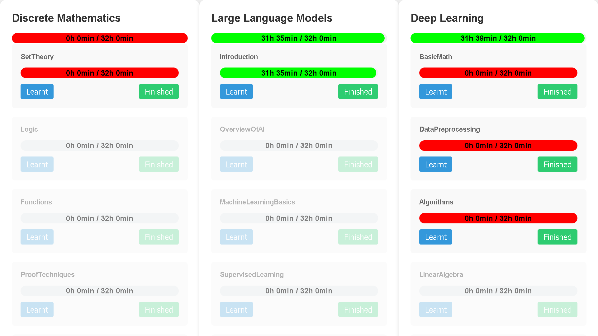

# CourseScheduler
Simple web app to find what one should learn next



## CourseScheduler App Overview:
The CourseScheduler is a learning management tool that helps users track their progress in various subjects and courses and decide on what to focus on next. The app has a visual interface that organizes learning content into columns and cards. Key Features:
1. Subject Tracking: The app shows different subjects as separate columns.
2. Course Management: Each subject contains multiple courses, displayed as cards.
3. Progress Visualization: Both subjects and courses have progress bars to show completion status.
4. Interactive Learning: Users can mark courses as "Learnt" or "Finished" using buttons on each course card.
5. Organized Layout: Subjects and courses are automatically sorted based on progress, making it easy to focus on what needs attention.
6. Time Management: The app will show time remaining for each subject and course, showing courses and subjects that should be done next.
7. Completed Course Indication: Courses that have been completed are displayed with a strikethrough style, making it easy to identify finished content at a glance.
The app's design allows users to quickly see their overall progress in different subjects and individual courses, helping them prioritize their learning efforts and track their educational journey effectively.

## Folder structure:
```
CourseScheduler/
├── subjects/
│ ├── Deep Learning/
│ │ ├── graph.txt
│ │ └── progress.json
│ ├── Discrete Mathematics/
│ │ ├── graph.txt
│ │ └── progress.json
│ └── Large Language Models/
│   ├── graph.txt
│   └── progress.json
├── backend.py
├── frontend.html
└── start-app-script.bat
```

## UI Description for `CourseScheduler` App:
1. Layout:
- The UI consists of multiple columns side by side.
- Each column represents a different subject.
- Columns are visually separated from each other.
2. Subject Columns:
- At the top of each column is the subject title.
- Below the title is a green progress bar for the subject.
- Columns are arranged from left to right in ascending order of progress percentage.
3. Course Cards:
- Each subject column contains multiple course cards.
- Cards are stacked vertically within the column.
- Cards are sorted from top to bottom: available courses first (least progress to most), then unavailable courses, and finally completed courses.
4. Course Card Structure:
- Each card represents a distinct course.
- At the top of the card is the course title (with strikethrough for completed courses).
- Below the title is a progress bar for the course.
- At the bottom of the card are two buttons: "Learnt" and "Finished".
5. Progress Bars:
- Both subject and course progress bars are present.
- They will show text in the format "Xh Ymin / Zh Tmin".
- This text represents current time remaining and total time.
6. Consistency:
- All course cards have the same layout and elements.
- The only differences between cards are the course titles, progress percentages, and completion status (strikethrough for completed courses).
7. Interactivity:
- Users can interact with the "Learnt" and "Finished" buttons on each course card.